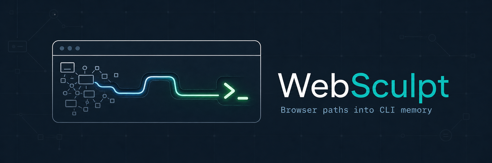

# WebSculpt

<p align="center">
  
</p>

[](https://www.npmjs.com/package/websculpt)
[](LICENSE)
[](package.json)
[](https://www.npmjs.com/package/websculpt)
[](https://www.typescriptlang.org/)

[English](README.md) · [中文](README_zh.md)

> **Every time a conversation ends, the Agent's web-surfing experience resets to zero.**
>
> Next week when you check the same website again, it starts from scratch—figuring out page structure, anti-bot measures, login flows—filling up the context window with exploration noise, leaving no room for the actual analysis.

**WebSculpt is the Agent's procedural memory.** It doesn't remember knowledge; it remembers the proven experience of "how to get data from a specific website." Through Harness, it constrains exploration behavior and distills successful paths into locally reusable `domain/action` commands; subsequent tasks invoke them directly, freeing up context space. The command library evolves with use, making the Agent smarter over time.


---

## Contents

- [1. Install](#1-install)
- [2. Usage](#2-usage)
- [3. Why WebSculpt](#3-why-websculpt)
- [4. Usage Examples](#4-usage-examples)
- [5. Core Concepts](#5-core-concepts)
- [6. Key Design Choices](#6-key-design-choices)
- [7. Documentation](#7-documentation)
- [8. Usage Statement](#8-usage-statement)
- [9. License](#9-license)

---

## 1. Install

```bash
# 1. Install CLI tool
npm install -g @playwright/cli@^0.1.8 websculpt

# 2. Install Skill for Agent
websculpt skill install --lang en       # Current project
# websculpt skill install --global --lang en   # Global scope
```

## 2. Usage

### Core Usage

After installing the Skill, simply describe your needs to the Agent. The Agent will automatically check the command library, explore information, and assess whether it's worth distilling—you only need to confirm the name and input/output, and the Agent completes all coding and installation.

> **You**: Check Hacker News top stories for me.
>
> **Agent**: Analyzing page structure, extracting data... Query complete. Also, this path is proven. Suggest distilling it into a `hackernews/get-top` command for direct future use. Confirm?
>
> **You**: Confirm.
>
> **Agent**: Distillation complete.
>
> ---
>
> **You**: Check Hacker News top stories for me.
>
> **Agent**: Invoking `hackernews/get-top`. Results returned in seconds, zero extra token consumption.

### Extended Command Quick Start

Extended commands fall into two categories: some work out of the box, others require connecting to a Chrome/Edge browser session.

```bash
# View all available commands
websculpt command list

# Zero-dependency commands (no browser needed)
websculpt hackernews get-top --limit 5

# Browser commands (reuse Chrome/Edge login state)
# 1. Open Chrome browser
# 2. Navigate to chrome://inspect/#remote-debugging
# 3. Check "Allow remote debugging for this browser instance" and keep browser open
websculpt github get-trending --language python --period weekly
```

### Meta Command Quick Reference

```bash
# Manually start background browser process (browser commands usually auto-start, for debugging)
websculpt daemon start

# Check daemon status
websculpt daemon status

# Stop background browser process
websculpt daemon stop

# Remove a user-distilled command
websculpt command remove <domain> <action>
```

---

## 3. Why WebSculpt

### Procedural Memory

Every time a conversation ends, the Agent's web-surfing experience resets to zero. Next week when you check the same website again, it starts from scratch—figuring out page structure, anti-bot measures, login flows—filling up the context window with exploration noise, leaving no room for the actual analysis. WebSculpt distills the Agent's successful information retrieval paths into locally reusable commands, forming continuously evolving **procedural memory**.

### Applicable Scenarios

1. **Setting up a browser environment is harder than getting the Agent to work?**

   You want to operate web pages, but Playwright, Puppeteer, CDP configuration docs are overwhelming, and the environment setup keeps failing.

   WebSculpt converges browser automation into a single protocol. The Agent connects directly to your currently open Chrome/Edge, reusing your login state and cookies. **No need to understand the underlying toolchain—just describe your needs.**

2. **Teaching the same website from scratch every time?**

   Every time the Agent checks Hacker News or GitHub Trends, it has to re-analyze page structure and trial-and-error selectors. The context is consumed by exploration, leaving no room for actual analysis.

   WebSculpt includes a set of ready-to-use commands out of the box. For new websites, let the Agent explore once and automatically distill it into a dedicated command, **permanently available, zero repeat cost.**

3. **Agent burns half its context just to look something up?**

   The Agent analyzes DOM on the fly, trial-and-error selectors, results are hit-or-miss, and tokens and context are quickly consumed.

   WebSculpt solidifies proven paths into commands. Subsequent invocations return structured JSON directly. **Zero exploration cost, stable and predictable results.**

4. **Agent gets lost halfway through slightly complex browser tasks?**

   Multi-page navigation, form filling, data extraction—the Agent runs out of context and breaks mid-chain.

   WebSculpt supports breaking down complex flows into multiple atomic commands, each responsible for a clear step. Combine them to stably complete complex tasks, **and each step is individually reusable.**

5. **Want to turn daily queries into CLI tools and integrate them into your workflow?**

   You frequently query a data source and want to turn it into a command-line tool, but don't know where to start.

   WebSculpt distilled commands output structured JSON, directly callable by scripts, CI pipelines, or other systems. **Your daily operations become programmable APIs.**

---

## 4. Usage Examples

### Access a Specific Website

> **You**: Check today's top stories on Hacker News for me.
>
> **Agent**: No match in command library. Accessing Hacker News directly... Query complete. Search results are often mixed and outdated, while direct website operation yields accurate structured data. This path is proven. Suggest distilling it into `hackernews/get-top` for direct future use. Confirm?
>
> **You**: Confirm.
>
> ---
>
> **You**: Check today's top stories on Hacker News for me.
>
> **Agent**: Invoking `hackernews/get-top`. Structured data returned in seconds, zero extra token consumption.

### Connect to a Logged-in Browser

> **You**: Check my GitHub notifications.
>
> **Agent**: No match in command library. Connecting to your Chrome... Detected that browser is currently logged into GitHub. Fetching data directly through existing session. Suggest distilling it into `github/get-notifications`, **requires keeping Chrome open and logged in**. Confirm?
>
> **You**: Confirm.
>
> ---
>
> **You**: Check my GitHub notifications.
>
> **Agent**: Invoking `github/get-notifications`. Chrome is currently in logged-in state. Fetching data directly through existing browser session.

### Build Your Own Command

> **You**: Create a command for me to monitor this product's price changes daily.
>
> **Agent**: Exploring target page... Confirmed price selector and page structure. Suggest distilling it into `shop/watch-price`, parameters support `url` and `threshold`. Confirm?
>
> **You**: Confirm.
>
> ---
>
> **You**: How much is this product now?
>
> **Agent**: Invoking `shop/watch-price`. Current price $199. The distilled command has entered the command library. Future similar requests will be automatically reused.

---

## 5. Core Concepts

**Command System**

WebSculpt has two types of commands:
- **Meta commands**: Manage the CLI itself and the command library, such as `explore`, `capture`, `command`, `skill`. Built into the system, cannot be overridden.
- **Extended commands**: Reusable information retrieval workflows, invoked by `domain/action` (e.g., `hackernews/get-top`). Further divided into:
  - **Builtin commands**: Distributed with WebSculpt
  - **User commands**: Distilled by the Agent into `~/.websculpt/commands/`. User commands have higher priority than Builtin, automatically overriding on name collision—the command library evolves with use.

**Lifecycle**

- **Explore**: The Agent's process of retrieving information. First checks the local command library to reuse existing paths; if no match, explores new paths via external tools.
- **Capture**: The process of solidifying a proven path into a command. The Agent automatically advances the workflow; users only need to confirm the name and input/output.

**Execution Environment (Runtime)**

- `node`: HTTP requests and data cleansing, zero dependencies
- `browser`: Connects to your currently open Chrome/Edge via Playwright, reusing your login state and cookies

---

## 6. Key Design Choices

### Two-Phase Skill Delivery

WebSculpt's complete functionality is divided into two sequentially connected Skills, directly delivered to the user's Agent:
- `websculpt-explore`: Information retrieval phase, discovering reusable paths
- `websculpt-capture`: Distillation phase, solidifying proven paths into commands

This is not loose usage advice, but deliverables containing complete protocols, state constraints, and delivery standards.

### Explore: Document Soft Constraints + Filesystem Truth

`websculpt-explore` first constrains the Agent's tool selection: must check the library and reuse builtin commands first, only allowed to explore new paths when no match; when browser automation is needed, converges to the single protocol of Playwright CDP connecting to the current browser.

Constraints are enforced through two mechanisms:
- **Document soft constraints**: Skill documents define protocol flows; the Agent follows rules to execute
- **Filesystem truth**: The Agent writes exploration traces to `trace.md`; `explore assess` performs structured audits (heading completeness, non-empty content, keyword safety rules, Assessment H3 subsection checks), blocking entry to capture until passed

### Capture: CLI State Checks + Artifact Pipeline

`websculpt-capture` further introduces CLI hard constraints on top of explore's constraints:
- The Agent doesn't need to understand the complete flow, only needs to loop executing `capture status`, advancing according to the returned `next.action`
- The distillation process is split into 6 Artifacts, advancing with strict layered dependencies
- Hard gates are established through Evidence Audit, Draft Fingerprint, and 4 sets of real tests; cannot finalize until all are passed

---

## 7. Documentation

**Usage**
- [`docs/CLI.md`](docs/CLI.md) — Usage, parameters, and output contracts for all commands

**Design and Implementation**
- [`docs/Capture.md`](docs/Capture.md) — Distillation workflow: six-artifact pipeline, state machine, hard-gate installation
- [`docs/Architecture.md`](docs/Architecture.md) — Four-layer system architecture and code organization
- [`docs/Daemon.md`](docs/Daemon.md) — Background browser process, IPC protocol, and resource management

---

## 8. Usage Statement

When using WebSculpt, please comply with the target website's robots.txt and Terms of Service. Use it only on publicly accessible data you are permitted to access; unauthorized data collection is prohibited.

## 9. License

Apache-2.0

---

## Star History

[](https://star-history.com/#bqw1013/WebSculpt&Date)
