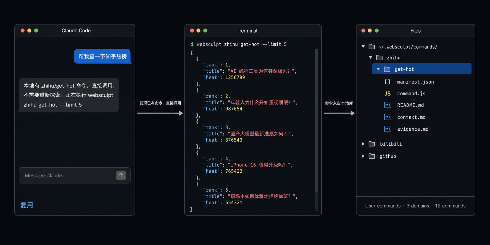
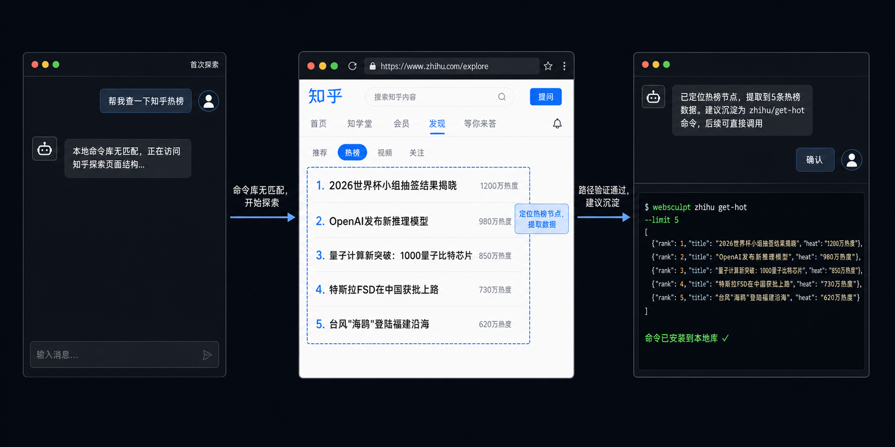

# WebSculpt

<p align="center">
  
</p>

<p align="center">
  
</p>

[](https://www.npmjs.com/package/websculpt)
[](LICENSE)
[](package.json)
[](https://www.npmjs.com/package/websculpt)
[](https://www.typescriptlang.org/)

[English](README_en.md)


---

## 目录

- [1. 安装](#1-安装)
- [2. 用法](#2-用法)
- [3. 核心概念](#3-核心概念)
- [4. AnyTrend 案例](#4-anytrend-案例)
- [5. 关键设计选择](#5-关键设计选择)
- [6. 文档](#6-文档)
- [7. 使用声明](#7-使用声明)
- [8. License](#8-license)

---

## 1. 安装

**环境要求**：Node.js >= 22

1. 安装 CLI 工具：

   ```bash
   npm install -g @playwright/cli@0.1.13 websculpt
   ```

2. 为 Agent 安装 Skill：

   ```bash
   websculpt skill install --lang zh       # 当前项目
   # websculpt skill install --global --lang zh   # 全局生效
   ```

3. 安装 Playwright Extension：

   WebSculpt 通过 Playwright Extension 连接到你当前打开的 Chrome，复用登录态、Cookie 和浏览器指纹。请在 Chrome 中安装：

   ```text
   https://chromewebstore.google.com/detail/playwright-extension/mmlmfjhmonkocbjadbfplnigmagldckm
   ```

   安装完成后保持 Chrome 打开即可，无需开启远程调试或额外配置。

## 2. 用法

### 2.1 通过 Agent 使用

安装 Skill 后，直接向 Agent 描述需求。Agent 自动检查命令库，有匹配则直接调用，无匹配则探索新路径并建议沉淀。

**复用已有命令**



**首次探索与沉淀**

命令库尚无匹配时，Agent 探索网页、提取数据、验证路径，确认后沉淀为新命令。下次同样需求，就回到上面的流程了。



需要登录态的网站，Agent 自动连接当前打开的 Chrome，复用登录态和 Cookie，无需提供账号密码。

### 2.2 直接在终端使用

沉淀后的命令本质上就是 CLI 命令，可以直接在终端调用，输出结构化 JSON，方便接入脚本、CI 或其他系统。

```bash
# 查看所有可用命令
websculpt command list

# 零依赖命令（无需浏览器）
websculpt bilibili get-hot --limit 5

# 浏览器命令（复用 Chrome 登录态，需保持浏览器打开）
websculpt zhihu get-hot --limit 5

# 元命令
websculpt daemon start|status|stop
websculpt command remove <domain> <action>
```

---

## 3. 核心概念

### 3.1 Skill 与自进化

WebSculpt 提供四个 Skill，交付给用户的 Agent，覆盖命令的完整生命周期：

| Skill | 做什么 | 触发时机 |
|---|---|---|
| **Explore** | 检查命令库优先复用，无匹配时探索新路径 | 每次需要获取外部信息 |
| **Capture** | 将已验证路径固化为命令，经状态机和校验后安装 | Explore 发现可复用路径，用户同意沉淀 |
| **Maintain** | 修复失效命令：反向导入工作区，重新验证，覆盖安装 | 命令执行报错，或需要迭代 |
| **Library** | 管理命令库：scope 白名单、export/import 迁移 | 命令多了需要治理或分享 |

把四个 Skill 串起来看，就是命令库的自进化：

- **Explore → Capture：库在增长。** 每完成一次探索和沉淀，命令库就多一条命令。Agent 下次遇同类任务直接调用，不再重新探索。不是开发者在写新功能——每用一次，库就强一点。
- **User 覆盖 Builtin：库在变好。** 同一条 `zhihu/get-hot`，你沉淀的版本会替换内置版本。库的质量随使用提升，而不是随发版提升。
- **Maintain 修复 → Capture 覆盖安装：库在自愈。** 网站改版命令失效，Maintain 把命令拉回工作区，重新探索页面结构，修好后覆盖安装。命令不会烂掉，它跟着目标网站一起演化。

### 3.2 命令

WebSculpt 有两类命令：

- **元命令**（Meta）：管理 CLI 本身和命令库，如 `explore`、`capture`、`command`、`skill`、`scope`。系统内置，不可被覆盖。
- **扩展命令**：可复用的信息获取工作流，按 `domain/action` 调用（如 `zhihu/get-hot`）。又分为：
  - **内置命令**（Builtin）：随 WebSculpt 分发
  - **用户命令**（User）：由 Agent 沉淀到 `~/.websculpt/commands/`。User 优先级高于 Builtin，同名时自动覆盖。

每条扩展命令包含以下文件：

| 文件 | 职责 |
|------|------|
| `manifest.json` | 元数据：描述、运行时、参数列表 |
| `command.js` | 执行逻辑 |
| `README.md` | 面向调用者的文档 |
| `context.md` | 面向修复者的上下文：沉淀背景、页面结构、失效信号 |
| `evidence.md` | 探索证据：已验证的 URL、选择器、失效信号 |

### 3.3 运行时

扩展命令支持两种运行时：

| 运行时 | 执行方式 | 适用场景 |
|--------|---------|---------|
| `node` | CLI 进程直接导入命令模块 | HTTP 请求、公开 API、数据清洗 |
| `browser` | 后台 daemon 进程通过 Playwright 连接 Chrome | DOM 操作、页面导航、需要登录态 |

Browser 运行时复用当前打开的 Chrome 登录态和 Cookie，Agent 不需要接触用户的账号密码。

### 3.4 命令库管理

**Scope — 控制显示范围**

命令库积累多了之后，`websculpt command list` 可能列出很多和当前项目无关的命令。Scope 在项目目录里维护一个白名单，让 `command list` 和帮助只显示相关命令，减少干扰。

- Scope 只影响 `command list` 的**显示**，不影响命令执行。白名单外的命令仍可直接调用。
- 当前目录没有 Scope 时，自动向上查找最近的祖先 Scope；都没有时显示全部命令。
- 通过 `capture finalize` 新安装的命令会自动加入当前项目的 Scope。

```bash
websculpt scope init                    # 启用 scope
websculpt scope add zhihu               # 添加整个域
websculpt scope add zhihu get-hot       # 添加单个命令
websculpt scope remove zhihu            # 移除
websculpt scope show                    # 查看当前白名单
websculpt scope destroy                 # 停用
```

**Export / Import — 迁移与分享**

命令库可以导出为普通目录，备份、换机或分享给团队；导入时自动校验，确保命令包完整。

```bash
# 导出全部命令
websculpt command export --to ./my-commands

# 导出指定域
websculpt command export zhihu --to ./my-commands

# 导入命令包
websculpt command import --from ./my-commands

# 预览导入效果（不写入）
websculpt command import --from ./my-commands --dry-run
```

导入前对包内所有命令执行 L1-L3 分层校验，任一校验失败则整体终止，不写入任何文件。同名命令默认跳过，`--force` 覆盖。

---

## 4. AnyTrend 案例

[AnyTrend](https://github.com/bqw1013/AnyTrend) 是基于 WebSculpt 命令构建的多平台热点日报系统，每天自动扫描多个平台，整理全球热点，生成日报。

<video src="https://github.com/user-attachments/assets/b2fc24a3-e4ef-49c2-8a1b-8e50e0f2fa71" controls muted width="100%"></video>

背后不是 Agent 每天从零探索——而是一组已经沉淀下来的 WebSculpt 命令在稳定执行。从首次探索各平台热点页面，到逐条沉淀为命令，到配置定时执行，AnyTrend 展示了 WebSculpt 的完整闭环：**探索一次，长期复用。**

详细的实现与命令清单见 [AnyTrend 仓库](https://github.com/bqw1013/AnyTrend)。

---

## 5. 关键设计选择

### 5.1 四 Skill 分阶段交付

WebSculpt 的功能被划分为四个前后衔接的 Skill——Explore 发现路径 → Capture 固化命令 → Maintain 持续维护 → Library 治理迁移。每个 Skill 不是独立工具，而是同一链条上的阶段，前一阶段的产出是后一阶段的输入。

### 5.2 Explore：文档软约束 + 文件系统真实

Explore 约束 Agent 的工具选择：必须优先查库复用，无匹配时才允许探索新路径；需要浏览器自动化时，收敛到 Playwright Extension 连接当前浏览器这一单一协议。

约束通过两种机制实现：
- **文档软约束**：Skill 文档定义协议流程，Agent 遵循规则执行。
- **文件系统真实**：Agent 将探索痕迹写入 `trace.md`，`explore assess` 执行结构化审计（标题完整性、内容非空、关键词安全规则、Assessment H3 子节检查），未通过前禁止进入 Capture。

### 5.3 Capture：CLI 状态机 + Artifact 流水线

Capture 在 Explore 的约束基础上引入 CLI 硬约束：
- Agent 无需理解完整流程，循环执行 `capture status`，按返回的 `next.action` 推进即可。
- 沉淀过程拆分为 6 个 Artifact（evidence → command → manifest → readme → context → validation），按严格分层依赖推进。
- Evidence Audit、Draft Fingerprint 和 4 组真实测试形成硬门槛，未全部通过前无法 finalize。

### 5.4 Maintain：修复也是 Capture

Maintain 不另造机制——它本质上是带有初始上下文的 Capture 流程。已安装命令通过 `capture import` 反向导入工作区，修改后重新走状态机 → validate → finalize --force。修复过程和新建过程受同一套校验门槛约束，不会因为"只是修一下"而绕过校验。

---

## 6. 文档

**使用**
- [`docs/CLI.md`](docs/CLI.md) — 所有命令的用法、参数和输出契约

**设计与实现**
- [`docs/Capture.md`](docs/Capture.md) — 沉淀工作流：六 Artifact 流水线、状态机、硬门槛安装
- [`docs/Architecture.md`](docs/Architecture.md) — 系统四层架构与代码组织
- [`docs/Daemon.md`](docs/Daemon.md) — 后台浏览器进程、IPC 协议与资源管理

---

## 7. 使用声明

使用 WebSculpt 请遵守目标网站的 robots.txt 及服务条款，仅对允许访问的公开数据使用，禁止用于未经授权的数据采集。

## 8. License

Apache-2.0

---

## Star History

[](https://star-history.com/#bqw1013/WebSculpt&Date)
