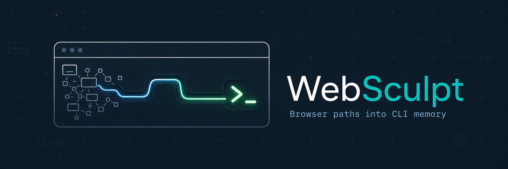
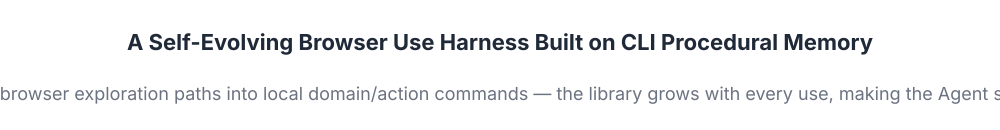
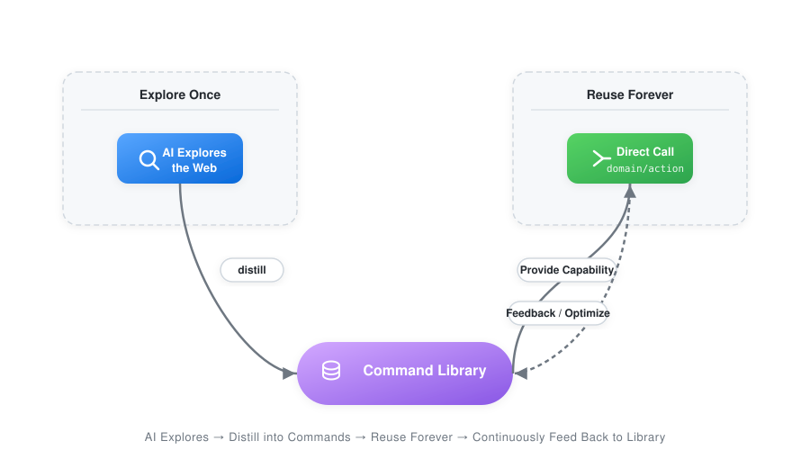
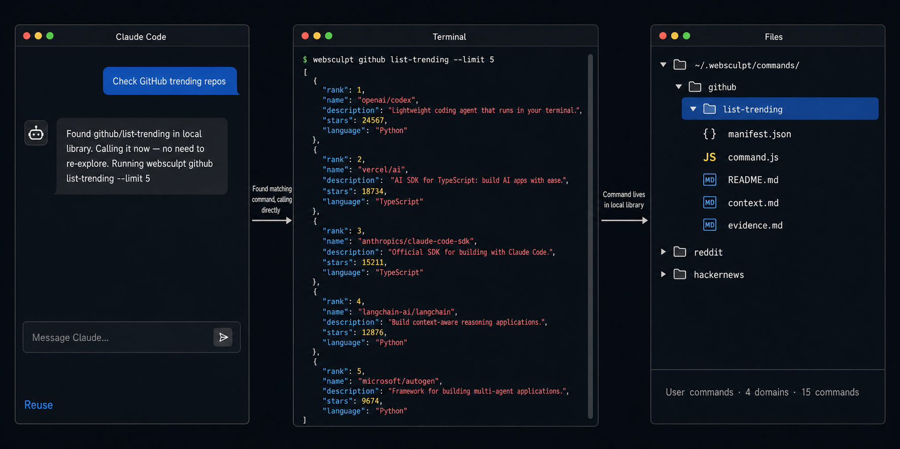
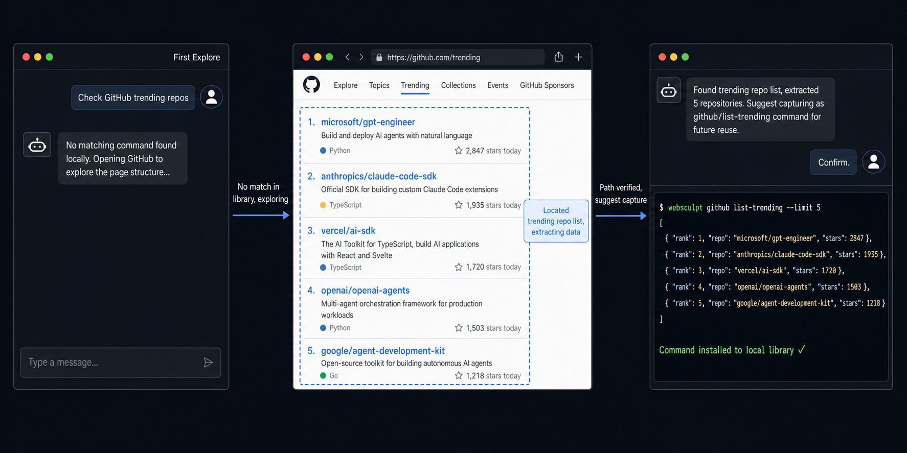

# WebSculpt

<p align="center">
  
</p>

<p align="center">
  
</p>

<p align="center">
  <a href="https://www.npmjs.com/package/websculpt"></a>
  <a href="https://www.npmjs.com/package/websculpt"></a>
  <a href="LICENSE"></a>
  <a href="https://discord.gg/R3tuUFUYm"></a>
  <a href="https://applink.feishu.cn/client/chat/chatter/add_by_link?link_token=317uf738-27e1-480c-be35-dfc9a889a86b"></a>
  <a href="README_zh.md"></a>
</p>



---

## Contents

- [1. Install](#1-install)
- [2. Usage](#2-usage)
- [3. Core Concepts](#3-core-concepts)
- [4. AnyTrend Case Study](#4-anytrend-case-study)
- [5. Key Design Choices](#5-key-design-choices)
- [6. Documentation](#6-documentation)
- [7. Usage Statement](#7-usage-statement)
- [8. License](#8-license)

---

## 1. Install

**Prerequisites**: Node.js >= 22

### 1.1 Via npm

```bash
# 1. Install CLI tool
npm install -g @playwright/cli@0.1.13 websculpt

# 2. Install Skills for Agent (installs into all global Agent directories)
websculpt skill install --global --lang en

# Optional: install only to specific agents (claude / codex / agents / workbuddy, comma-separated)
# websculpt skill install --global --agents claude --lang en

# Optional: install only for the current project
# websculpt skill install --lang en
```

Manage with `websculpt skill status` / `websculpt skill uninstall`. See the `skill` section in [`docs/CLI.md`](docs/CLI.md) for full options.

### 1.2 Via OpenClaw Plugin

```bash
openclaw plugins install clawhub:@bqw1013/websculpt-plugin --acknowledge-clawhub-risk
```

## 2. Usage

### 2.0 Prerequisite: Enable Chrome Remote Debugging

Before letting the Agent use your browser:

1. Open `chrome://inspect/#remote-debugging` in the Chrome address bar
2. Check "Allow remote debugging" and keep Chrome running

Without this, the Agent cannot connect to your browser.


### 2.1 Via Agent

After installation, you can invoke one of the following three Skills directly in your Agent. You can also simply describe what you need and let the Agent choose.

**Explore: Get External Information**

```text
/websculpt-explore Use my browser to show me the top 5 repositories on GitHub Trending
```

If a relevant memory already exists as a local CLI command, the Agent reuses it directly instead of exploring the website again. This significantly reduces context and token usage while making execution faster and more reliable.

Only when no matching command exists does the Agent explore a website, API, or browser session. If the path is worth reusing, it asks for your confirmation before distilling it into a new command.

**Maintain: Repair or Extend a Command**

```text
/websculpt-maintain The GitHub Trending command stopped working. Please fix it
```

Use it to repair broken commands, add parameters, or adjust their output.

**Library: Manage and Migrate the Command Library**

```text
/websculpt-library Export the GitHub Trending command to ./github-commands
```

```text
/websculpt-library Import the commands from ./github-commands into my local command library
```

It can also narrow the commands shown in the current project, or back up, migrate, and share the entire library.

### 2.2 CLI Commands: Executable Memory

WebSculpt saves a verified information retrieval path as a local CLI command. For example:

```bash
websculpt github get-trending --limit 5
```

Here, `github/get-trending` stores the complete browser automation path for opening GitHub Trending and extracting repositories; `--limit 5` requests the first five results.

Running this command directly reuses that browser automation memory, without analyzing the page or rediscovering the data path.

```bash
# List available commands
websculpt command list

# View command usage
websculpt github get-trending --help

# Reuse the command directly
websculpt github get-trending --limit 5
```

### 2.3 Builtin Command Library

WebSculpt ships with a builtin command library: verified information retrieval paths for **24 platforms / 164 commands**, ready to use out of the box.

| Platform | # | Platform | # | Platform | # |
|----------|---|----------|---|----------|---|
| 🐙 github | 15 | ❓ quora | 7 | 💌 substack | 6 |
| 🧠 huggingface | 13 | 🎵 spotify | 7 | 📡 techmeme | 6 |
| 🚀 producthunt | 10 | 📄 arxiv | 6 | 🎥 vimeo | 6 |
| 📈 stocktwits | 10 | 🎬 dailymotion | 6 | ▶️ youtube | 6 |
| ✍️ medium | 10 | 👥 facebook | 6 | 💰 kickstarter | 4 |
| 💬 hackernews | 9 | 📸 instagram | 6 | 📺 bilibili | 1 |
| 📰 techcrunch | 8 | 📌 pinterest | 6 | 🔥 weibo | 1 |
| 🎮 twitch | 8 | 👽 reddit | 6 | 💡 zhihu | 1 |

Browse the full set at runtime:

```bash
websculpt command domains               # All available platforms
websculpt command list github           # Commands under one platform
```

### 2.4 Core Logic: Explore Once, Reuse Long Term

**Existing Memory: Call It Directly**

When the Agent finds a matching command, it calls it directly from the local command library.



**No Existing Memory: Explore and Distill**

After completing the exploration and delivering the result, the Agent asks for your confirmation if the path is worth reusing. Once confirmed, the internal Capture pipeline generates and validates a new command so it can be called directly next time.



---

## 3. Core Concepts

### 3.1 Skills and Self-Evolution

WebSculpt provides four Skills, delivered to the user's Agent, covering the complete lifecycle of a command:

| Skill | What It Does | When It Triggers |
|---|---|---|
| **Explore** | Checks the command library first for reuse, explores new paths when no match is found | Every time external information is needed |
| **Capture** | Solidifies a verified path into a command, installed after passing a state machine and validation gates | Explore finds a reusable path, user agrees to distill |
| **Maintain** | Repairs broken commands: reverse-imports into a workspace, re-explores page structure, overwrites the installed version | Command execution fails, or iteration is needed |
| **Library** | Manages the command library: scope whitelists, export/import for migration and sharing | Library grows and needs governance or sharing |

Connect the four Skills together, and you get a self-evolving command library:

- **Explore → Capture: the library grows.** Each successful exploration and distillation adds one command to the library. The Agent calls it directly next time instead of re-exploring. This is not developers writing new features — every use makes the library a little stronger.
- **User overrides Builtin: the library improves.** For the same `github/get-trending`, your distilled version replaces the builtin one. Library quality improves with use, not with releases.
- **Maintain → Capture overwrite: the library self-heals.** When a website redesign breaks a command, Maintain pulls it back into a workspace, re-explores the page structure, repairs it, and overwrites the installed version. Commands don't rot — they evolve alongside their target websites.

In addition, the `websculpt/` and `websculpt-en/` directories at the repository root are bootstrap skills (Chinese/English) distributed through skill marketplaces; they are not part of the lifecycle above. Their only job is to probe the environment on the Agent's first trigger, install the CLI, and land the four lifecycle skills via `skill install`, after which they go dormant. They are not shipped with the npm package and are not managed by `skill install`, which is why they live outside `skills/`.

### 3.2 Commands

WebSculpt has two types of commands:

- **Meta commands**: Manage the CLI and command library, such as `explore`, `capture`, `command`, `skill`, `scope`. Built into the system, cannot be overridden.
- **Extended commands**: Reusable information retrieval workflows, invoked by `domain/action` (e.g., `github/get-trending`). Further divided into:
  - **Builtin commands**: Distributed with WebSculpt
  - **User commands**: Distilled by the Agent into `~/.websculpt/commands/`. User commands take priority over Builtin, automatically overriding on name collision.

Each extended command consists of the following files:

| File | Purpose |
|------|---------|
| `manifest.json` | Metadata: description, runtime, parameter list |
| `command.js` | Execution logic |
| `README.md` | Caller-facing documentation |
| `context.md` | Maintainer-facing context: distillation background, page structure, failure signals |
| `evidence.md` | Exploration evidence: verified URLs, selectors, failure signals |

### 3.3 Runtime

Extended commands support two runtimes:

| Runtime | Execution Method | Use Case |
|---------|-----------------|----------|
| `node` | CLI process directly imports the command module | HTTP requests, public APIs, data cleansing |
| `browser` | Background daemon process connects to Chrome via Playwright | DOM manipulation, page navigation, login state |

The browser runtime reuses the login state and cookies of the currently open Chrome. The Agent never touches your credentials.

### 3.4 Command Library Management

**Scope — Controlling Visibility**

As the command library grows, `websculpt command list` may show many commands irrelevant to the current project. Scope maintains a whitelist in the project directory so `command list` and help only display relevant commands.

- Scope only affects the **display** of `command list`, not command execution. Commands outside the whitelist can still be invoked directly.
- When no Scope exists in the current directory, the nearest ancestor Scope is used automatically. When none is found, all commands are shown.
- Newly installed commands via `capture finalize` are automatically added to the current project's Scope.

```bash
websculpt scope init                    # Enable scope
websculpt scope add github              # Add an entire domain
websculpt scope add github get-trending  # Add a single command
websculpt scope remove github           # Remove
websculpt scope show                    # View current whitelist
websculpt scope destroy                 # Disable

websculpt command domains               # Browse visible domains (scope-aware)
websculpt command list github           # List commands under one domain
```

**Export / Import — Migration and Sharing**

The command library can be exported as a plain directory for backup, machine migration, or team sharing. Imported commands are validated automatically to ensure package integrity.

```bash
# Export all commands
websculpt command export --to ./my-commands

# Export a specific domain
websculpt command export github --to ./my-commands

# Import a command package
websculpt command import --from ./my-commands

# Preview import result (dry run, no writes)
websculpt command import --from ./my-commands --dry-run
```

All commands in the package undergo L1–L3 layered validation before import. If any command fails validation, the entire import is aborted with no files written. Existing commands with the same name are skipped by default; use `--force` to overwrite.

---

## 4. AnyTrend Case Study

[AnyTrend](https://github.com/bqw1013/AnyTrend) is a multi-platform trending news daily report system built on WebSculpt commands. It automatically scans multiple platforms every day, aggregates global trending topics, and generates a daily report.

<video src="https://github.com/user-attachments/assets/b2fc24a3-e4ef-49c2-8a1b-8e50e0f2fa71" controls muted width="100%"></video>

Behind the scenes, it's not the Agent starting from scratch every day — it's a set of already-distilled WebSculpt commands running reliably. From the initial exploration of each platform's trending pages, to distilling each into a command, to scheduling daily execution, AnyTrend demonstrates WebSculpt's complete closed loop: **explore once, reuse forever.**

For detailed implementation and the full command list, see the [AnyTrend repository](https://github.com/bqw1013/AnyTrend).

---

## 5. Key Design Choices

### 5.1 Four-Skill Phased Delivery

WebSculpt's functionality is divided into four sequentially connected Skills — Explore discovers paths → Capture solidifies commands → Maintain keeps them healthy → Library governs and migrates. Each Skill is not a standalone tool but a phase in a single chain; the output of one phase is the input to the next.

### 5.2 Explore: Document Soft Constraints + Filesystem Truth

Explore constrains the Agent's tool selection: must check the command library first for reuse, only allowed to explore new paths when no match exists; when browser automation is needed, converge to the single protocol of Playwright CDP connecting to the current browser.

Constraints are enforced through two mechanisms:
- **Document soft constraints**: Skill documents define protocol flows; the Agent follows the rules.
- **Filesystem truth**: The Agent writes exploration traces to `trace.md`; `explore assess` performs structured audits (heading completeness, non-empty content, keyword safety rules, Assessment H3 subsection checks), blocking entry to Capture until passed.

### 5.3 Capture: CLI State Machine + Artifact Pipeline

Capture introduces CLI hard constraints on top of Explore's foundation:
- The Agent doesn't need to understand the full flow — it loops `capture status` and advances according to the returned `next.action`.
- The distillation process is split into 6 Artifacts (evidence → command → manifest → readme → context → validation), advancing with strict layered dependencies.
- Evidence Audit, Draft Fingerprint, and 4 sets of real-world tests form hard gates; finalize is blocked until all are passed.

### 5.4 Maintain: Repair Is Also Capture

Maintain doesn't invent a separate mechanism — it's essentially a Capture workflow with pre-filled context. Installed commands are reverse-imported via `capture import` into a workspace, modified, and then re-run through the state machine → validate → finalize --force. This ensures repairs are subject to the same validation gates as new commands — no bypassing just because "it's just a quick fix."

---

## 6. Documentation

**Usage**
- [`docs/CLI.md`](docs/CLI.md) — Usage, parameters, and output contracts for all commands

**Design and Implementation**
- [`docs/Capture.md`](docs/Capture.md) — Distillation workflow: six-artifact pipeline, state machine, hard-gate installation
- [`docs/Architecture.md`](docs/Architecture.md) — Four-layer system architecture and code organization
- [`docs/Daemon.md`](docs/Daemon.md) — Background browser process, IPC protocol, and resource management

---

## 7. Usage Statement

When using WebSculpt, please comply with the target website's robots.txt and Terms of Service. Use it only on publicly accessible data you are permitted to access; unauthorized data collection is prohibited.

## 8. License

Apache-2.0

---

## Star History

[](https://star-history.com/#bqw1013/WebSculpt&Date)
