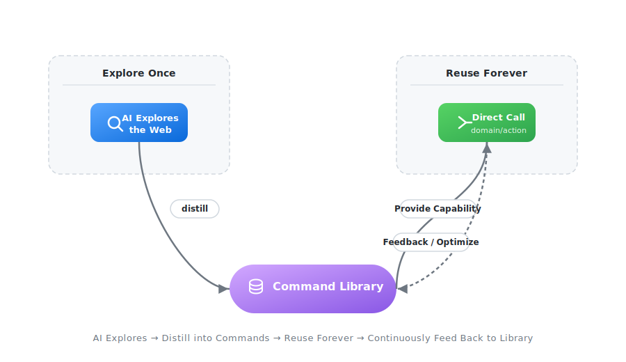

# WebSculpt

[](https://www.npmjs.com/package/websculpt)
[](LICENSE)
[](package.json)
[](https://www.npmjs.com/package/websculpt)
[](https://www.typescriptlang.org/)

[English](README_en.md) · [中文](README.md)

> **Tired of reinventing the wheel every time an Agent needs to gather information?**
>
> Searching through page structure, anti-bot measures, and DOM selectors fills up the context window with exploration noise, leaving no room for the actual analysis. The successful path disappears when the conversation ends, and you start all over again next time.

**WebSculpt is a harness for information retrieval.** Its core principle is "explore once, reuse forever": AI-discovered information retrieval paths are distilled into locally reusable `domain/action` commands; subsequent tasks invoke them directly, freeing up context space. The accumulated command library evolves with use, making the Agent smarter over time.



---

## Table of Contents

- [What Problem Does This Solve](#what-problem-does-this-solve)
- [Usage](#usage)
- [Good Fit For](#good-fit-for)
- [Core Concepts](#core-concepts)
- [What Does a Distilled Command Look Like](#what-does-a-distilled-command-look-like)
- [Documentation Map](#documentation-map)
- [Known Limitations](#known-limitations)
- [Usage Statement](#usage-statement)
- [License](#license)

---

## What Problem Does This Solve

| | Without WebSculpt | With WebSculpt |
|---|---|---|
| Structured data extraction from a site | Agent analyzes DOM on the fly → trial and error → consumes massive context | Check local command library → direct invocation → JSON returned in seconds |
| Pages requiring login state | Re-explore login flow and page structure every time | Reuse distilled session strategies and interaction paths |
| Check again next week | Explore from scratch | Command executes directly, results are stable and predictable |
| Across sessions | Previous success is lost | Command library accumulates, Agent capabilities grow over time |

---

## Usage

WebSculpt consists of a CLI and an Agent Skill. You state the requirement; the Agent handles execution.

### 1. Install

```bash
npm install -g @playwright/cli websculpt
websculpt config init
websculpt skill install
```

### 2. State Your Requirements

Whenever you have an information retrieval need, simply tell the Agent. For example:

> "Summarize this week's hot discussions from these tech communities"
> "Compile the latest product updates into a table"

The Agent will automatically check whether a distilled command is available in the library; if not, it will explore on its own and evaluate whether to distill the result. You do not need to care about the specific CLI usage.

---

## Good Fit For

- **Multi-source information aggregation**: Continuously extract structured data from frequently visited sites to feed analysis, reporting, or monitoring
- **Stateful page retrieval**: Reuse browser login state and interaction paths to access non-public or dynamically rendered data
- **Personal / team command library**: Accumulate a private set of fast paths to your data sources; the Agent gets faster with use

> WebSculpt focuses on "how to reliably obtain data". Analysis, judgment, and decision-making after data retrieval are left to the Agent based on its own capabilities.

---

## Core Concepts

| Concept | Description |
|---------|-------------|
| **Command Library** | Locally reusable information retrieval commands for the Agent, named in `domain/action` format (e.g. `github/list-trending`). Divided into Builtin (project built-in) and User (Agent distilled). |
| **Skill** | A set of conventions the Agent automatically follows after installation, including tool selection strategy, exploration workflow, and distillation contract. |
| **Runtime** | `node` (HTTP requests, data cleansing) or `playwright-cli` (browser automation, reusable login state). A command can declare only one runtime. |

---

## What Does a Distilled Command Look Like

A successful exploration is distilled into a parameterizable command package stored in the local command library:

```
~/.websculpt/commands/<domain>/<action>/
  ├── manifest.json      # Command metadata: purpose, parameters, runtime
  ├── command.js         # Execution logic: selectors, cleansing, error handling
  ├── README.md          # Instructions for callers
  └── context.md         # Background and failure signals for maintainers
```

It is essentially the Agent's experience of "how I scraped data from this web page" turned into a maintainable, version-controllable, reusable local asset.

> Since commands run locally and may reuse your browser session via `playwright-cli`, it is recommended to periodically review the logic in your command library to avoid unintended page operations.

---

## Documentation Map

| Document | Content | For Whom |
|----------|---------|----------|
| [`docs/CLI.md`](docs/CLI.md) | Usage, parameters, and output contracts for all Meta commands | When consulting the manual |
| [`docs/Architecture.md`](docs/Architecture.md) | Four-layer system architecture and code organization | Developers, contributors |
| `skills/websculpt/` | Complete Agent Skill deliverables (strategy, contract, operating guide) | **Agents with the Skill installed** |

> **Early version note**: WebSculpt is in active development. Builtin commands are provided as examples only; the core design goal is to help you distill your own command library through daily information retrieval tasks. Commands may break when target site structures change; please set expectations accordingly.

---

## Known Limitations

- The `shell` and `python` runtimes already support the full command package lifecycle (`draft`, `validate`, `create`), but the CLI execution engine has not yet been wired in.
- The full interaction flow and auto-trigger mechanism for the self-healing loop (automatic repair proposals after command failure) are not yet implemented.

## Usage Statement

When using WebSculpt, please comply with the target website's robots.txt and Terms of Service. Use it only on publicly accessible data you are permitted to access; unauthorized data collection is prohibited.

## License

MIT

---

## Star History

[](https://star-history.com/#bqw1013/WebSculpt&Date)
