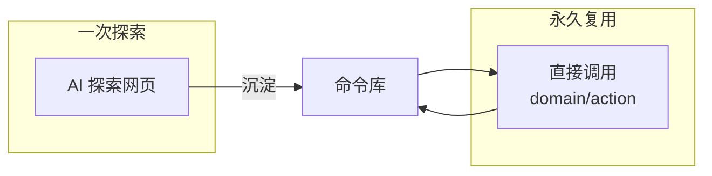

# WebSculpt

[](https://www.npmjs.com/package/websculpt)
[](LICENSE)
[](package.json)
[](https://www.npmjs.com/package/websculpt)
[](https://github.com/bqw1013/websculpt)
[](https://www.typescriptlang.org/)

[English](README.md) · [中文](README_zh.md)

> **Agent 每次查资料都在重复造轮子？**
>
> 找一次网页结构、反爬策略、DOM 选择器，上下文窗口被探索过程占满，真正该做的分析却放不下。成功路径随对话结束而消失，下次再来一遍。

**WebSculpt 是面向信息获取的 Harness。** 它把"一次探索，永久复用"作为核心：AI 跑通的信息获取路径，沉淀为本地可复用的 `domain/action` 命令；后续直接调用，释放上下文空间。沉淀下来的命令库随使用不断进化，Agent 越用越聪明。



---

## 目录

- [这解决了什么问题](#这解决了什么问题)
- [用法](#用法)
- [适合做什么](#适合做什么)
- [核心概念](#核心概念)
- [沉淀下来的命令长什么样](#沉淀下来的命令长什么样)
- [文档地图](#文档地图)
- [已知限制](#已知限制)
- [使用声明](#使用声明)
- [License](#license)

---

## 这解决了什么问题

| | 不用 WebSculpt | 用 WebSculpt |
|--|--|--|
| 获取一个站点的结构化数据 | Agent 现场分析 DOM → 试错 → 占用大量上下文 | 检查本地命令库 → 直接调用 → 秒级返回 JSON |
| 需要登录态的页面 | 每次重新摸索登录流程和页面结构 | 复用已沉淀的会话策略与交互路径 |
| 下周再查一次 | 从头探索一遍 | 命令直接执行，结果稳定可预期 |
| 跨会话 | 上次成功经验丢失 | 命令库持续累积，Agent 能力随时间增长 |

---

## 用法

WebSculpt 由 CLI 和 Agent Skill 两部分组成。你负责提需求，Agent 负责执行。

### 1. 安装

```bash
npm install -g websculpt
websculpt config init
websculpt skill install
```

### 2. 提需求

之后有信息获取类需求时，直接告诉 Agent 即可。例如：

> "汇总这几个技术社区本周的热门讨论"
> "把目标产品的最新更新变动整理成表格"

Agent 会自动检查命令库中是否有已沉淀的命令可用，没有则自行探索并评估是否沉淀。你不需要关心 CLI 的具体用法。

---

## 适合做什么

- **多源信息聚合**：从常访问的站点持续提取结构化数据，为分析、报告或监控提供素材
- **带状态的页面获取**：复用浏览器登录态与交互路径，获取非公开或动态渲染的数据
- **个人/团队命令库**：随着使用沉淀出一套私有数据源的快路径，Agent 越用越快

> WebSculpt 聚焦于"如何稳定拿到数据"。拿到数据之后的分析、判断与决策，由 Agent 基于自身能力完成。

---

## 核心概念

| 概念 | 说明 |
|------|------|
| **命令库** | Agent 本地可复用的信息获取命令，按 `domain/action` 命名（如 `github/list-trending`）。分为 Builtin（项目内置）和 User（Agent 沉淀）。 |
| **Skill** | 安装后 Agent 自动遵循的规范集合，包含工具选择策略、探索流程、沉淀契约。 |
| **运行时** | `node`（HTTP 请求、数据清洗）或 `playwright-cli`（浏览器自动化、复用登录态）。一个命令只能声明一种运行时。 |

---

## 沉淀下来的命令长什么样

一次成功探索会被沉淀为一个可参数化的命令包，存于本地命令库：

```
~/.websculpt/commands/<domain>/<action>/
  ├── manifest.json      # 命令元数据：用途、参数、运行时
  ├── command.js         # 执行逻辑：选择器、清洗、异常处理
  ├── README.md          # 面向调用者的说明
  └── context.md         # 面向修复者的沉淀背景与失效信号
```

它本质上是 Agent 把"我怎么把这个网页上的数据抠下来"的经验，写成了一份可维护、可版本控制、可复用的本地资产。

> 由于命令在本地运行，并可能通过 `playwright-cli` 复用你的浏览器会话，建议定期审查命令库中的逻辑，避免非预期的页面操作。

---

## 文档地图

| 文档 | 内容 | 适合谁 |
|------|------|--------|
| [`docs/CLI.md`](docs/CLI.md) | 所有 Meta 命令的用法、参数和输出契约 | 查手册时 |
| [`docs/Architecture.md`](docs/Architecture.md) | 系统四层架构、代码组织方式 | 开发者、贡献者 |
| `skills/websculpt/` | Agent Skill 完整交付物（策略、契约、操作指南） | **已安装 Skill 的 Agent** |

> **早期版本提示**：WebSculpt 处于活跃开发阶段，Builtin 命令仅作示例参考，核心设计目标是帮助你在日常信息获取任务中沉淀属于自己的命令库。命令可能因目标站点结构变化而失效，请合理预期。

---

## 已知限制

- `shell` 与 `python` 运行时已完成命令包生命周期支持（`draft`、`validate`、`create`），但 CLI 执行引擎尚未接入。
- 自愈闭环（命令失效后的自动修复提案）的完整交互流程与自动触发机制尚未实现。

## 使用声明

使用 WebSculpt 请遵守目标网站的 robots.txt 及服务条款，仅对允许访问的公开数据使用，禁止用于未经授权的数据采集。

## License

MIT

---

## Star History

[](https://star-history.com/#bqw1013/WebSculpt&Date)
